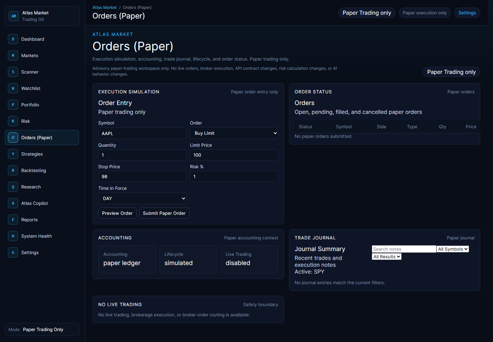
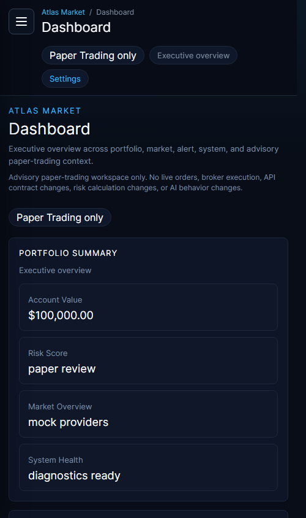

# Atlas Market

Atlas Market is a production-deployed paper-trading workspace for market research, portfolio review, risk visibility, strategy analysis, and AI-assisted decision support.

Production: https://atlas-market.netlify.app

Version: `v1.0.0`

Atlas is intentionally paper-trading-only and advisory-only. It does not provide financial advice, does not connect to live brokerage execution, and does not place or route real-money orders.

## Screenshots

### Desktop Orders Workspace



### Narrow Dashboard Workspace



## Product Overview

Atlas Market turns a long single-page trading dashboard into a modular desktop-style trading operating system. The application uses a permanent navigation shell, route-level workspace loading, responsive navigation, and dedicated workspaces for the major areas of a paper-trading workflow.

The product is designed for:

- reviewing portfolio health and exposure
- monitoring watchlists, signals, scanner candidates, and market context
- evaluating risk, position sizing, guardrails, and drawdown state
- simulating paper orders and reviewing paper order history
- composing strategies and reviewing backtests
- using Atlas Copilot for bounded advisory analysis
- checking reports, diagnostics, release readiness, and system health

## Key Features

- Institutional multi-page workspace shell with persistent top navigation and sidebar
- React Router navigation with direct route refresh support on Netlify
- Lazy-loaded workspace routes and split production chunks
- Dashboard executive overview for portfolio, risk, market, alerts, activity, and system state
- Dedicated Markets, Scanner, Watchlist, Portfolio, Risk, Orders, Strategies, Backtesting, Research, Copilot, Reports, System Health, and Settings workspaces
- Paper-only order entry, simulated lifecycle, accounting context, journal summary, and no-live-trading boundary
- Advisory-only Atlas Copilot with provider-safe AI routing and deterministic safety checks
- Portfolio intelligence, risk metrics, opportunity review, research context, and release diagnostics
- Responsive desktop, tablet, and narrow/mobile shell
- Route-level safe fallback and accessible loading states
- Release verification command covering tests, lint, build, performance budget, migration safety, and sensitive-material checks

## Workspace Map

| Route | Workspace | Purpose |
| --- | --- | --- |
| `/dashboard` | Dashboard | Executive overview |
| `/markets` | Markets | Market data, streaming, provider health, regimes, research score |
| `/scanner` | Scanner | Signals, scanner candidates, alerts, opportunity ranking and review |
| `/watchlist` | Watchlist | Priority symbols and watchlist context |
| `/portfolio` | Portfolio | Positions, performance, allocation, exposure, diversification |
| `/risk` | Risk | Risk score, guardrails, position sizing, open risk, reports |
| `/orders` | Orders | Paper-only order simulation, accounting, journal, lifecycle |
| `/strategies` | Strategies | Strategy builder, rules, signal composer, lifecycle, registry |
| `/backtesting` | Backtesting | Replay, performance, walk-forward, Monte Carlo review |
| `/research` | Research | Market intelligence, research score, timeframe analysis, AI advisory context |
| `/copilot` | Atlas Copilot | Safe advisory conversation, portfolio analysis, history, limitations |
| `/reports` | Reports | Paper reports, audit, exports, history, CSV/JSON summaries |
| `/health` | System Health | Runtime health, diagnostics, deployment, release candidate status |
| `/settings` | Settings | Workspace preferences, theme, paper settings, mock providers |

## Architecture Overview

```text
App.jsx
  -> AppRoutes.jsx
  -> WorkspaceLayout
  -> React.lazy workspace routes
  -> workspace-owned sections and panels
```

`App.jsx` is a lightweight bootstrap. `AppRoutes.jsx` owns route definitions and lazy imports. `WorkspaceLayout` owns the persistent shell, breadcrumbs, responsive sidebar, top navigation, Suspense fallback, and route error boundary. Each workspace owns its own presentation module under `src/workspaces`.

The Netlify SPA fallback is configured in `netlify.toml`:

```toml
[[redirects]]
  from = "/*"
  to = "/index.html"
  status = 200
```

This allows direct navigation and browser refresh on workspace routes.

## Technology Stack

- React 19
- React Router
- Vite
- Vitest
- ESLint
- Netlify hosting and functions
- PostgreSQL client support through `pg`
- JavaScript modules with route-level lazy loading

## Local Installation

```bash
npm install
npm run dev
```

Local development uses Vite. Netlify local development is available with:

```bash
npm run netlify:dev
```

## Environment Variables

Use `.env.example` as the names-only contract. Do not commit secrets or real values.

- `NODE_ENV`
- `TRADING_MODE`
- `LOG_LEVEL`
- `DATABASE_URL`
- `VITE_APP_TITLE`
- `VITE_FINNHUB_API_KEY`
- `VITE_TWELVEDATA_API_KEY`
- `NETLIFY_SITE_ID`
- `NETLIFY_AUTH_TOKEN`

Provider-backed market data depends on valid provider keys and service availability. The UI can still operate with mock or degraded provider states when configured that way.

## Commands

Development:

```bash
npm run dev
npm run preview
npm run netlify:dev
```

Validation:

```bash
npm run lint
npm test
npm run build
npm run release:verify
```

Performance:

```bash
npm run performance:check
```

## Deployment Architecture

Atlas Market deploys to Netlify from the `main` branch. Production output is generated with `npm run build` and served from `dist`. Netlify functions live under `netlify/functions`. The SPA redirect sends all workspace paths to `index.html` so React Router can render the correct lazy workspace.

Production deployment verified for v1.0.0:

- production URL loads
- all workspace routes return HTTP 200
- direct route refresh works
- independent workspace chunks are emitted
- release verification and performance budget pass

## Paper-Trading And Advisory Boundaries

Atlas Market is not a live trading platform.

- No live brokerage execution
- No broker order routing
- No real-money trading
- No financial advice
- Paper order simulation only
- AI output is advisory and human-reviewed only
- Paper simulation results do not guarantee real-world outcomes

## AI Assistance Disclosure

User-owned work:

- product vision
- feature requirements
- architecture direction
- validation decisions
- testing and release decisions
- debugging approval
- deployment ownership

AI-assisted work:

- code generation
- refactor proposals
- test scaffolding
- documentation drafting
- debugging suggestions

Atlas Copilot and provider-backed AI features are designed as advisory layers. AI output is treated as untrusted until it passes deterministic Atlas validation and safety boundaries.

## Technical Documentation

- [Atlas Market Enterprise Architecture v1.0](docs/architecture/ATLAS_MARKET_ENTERPRISE_ARCHITECTURE_V1.md)
- [Atlas Market Implementation Roadmap v1.0](docs/roadmap/ATLAS_MARKET_IMPLEMENTATION_ROADMAP_V1.md)
- [Architectural Decision Record Index](docs/adr/README.md)
- [Atlas Market Engineering Process](docs/process/ATLAS_MARKET_ENGINEERING_PROCESS.md)
- [Technical Portfolio Documentation](docs/TECHNICAL_PORTFOLIO.md)
- [v1.0.0 Release Notes](docs/releases/v1.0.0.md)
- [Release Checklist](docs/RELEASE_CHECKLIST.md)
- [Architecture Decision Record](docs/adr/0001-trading-os-architecture.md)

## Roadmap

Near-term work after v1.0.0:

- production smoke-test scripts with browser-console capture
- richer workspace summaries where useful
- demo video and portfolio case study
- additional screenshots for every workspace
- deeper provider-health documentation
- tighter form and table polish across older panel surfaces

Deferred or out of scope:

- live brokerage execution
- autonomous trading agents
- financial advice
- destructive recovery controls
- uncontrolled provider/model selection

## Contribution Summary

Atlas Market v1.0.0 is the result of user-directed product requirements, safety constraints, architecture decisions, validation ownership, and production deployment decisions, with AI assistance used for implementation support, refactor drafting, tests, documentation, and debugging suggestions.
